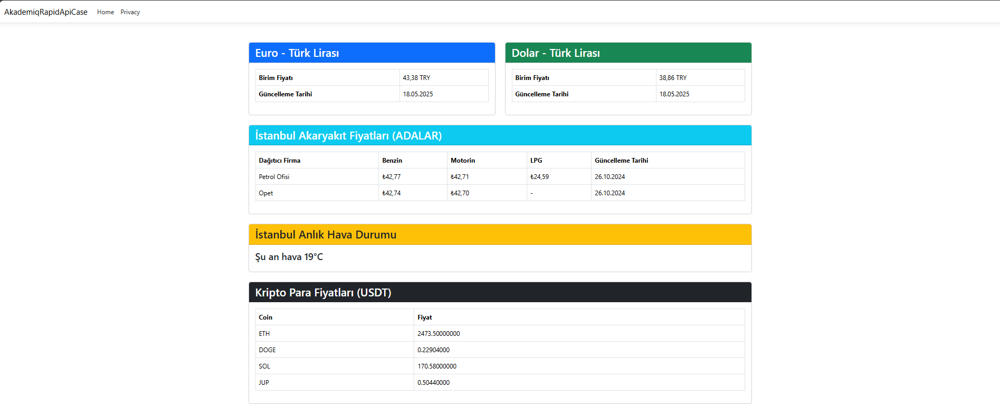
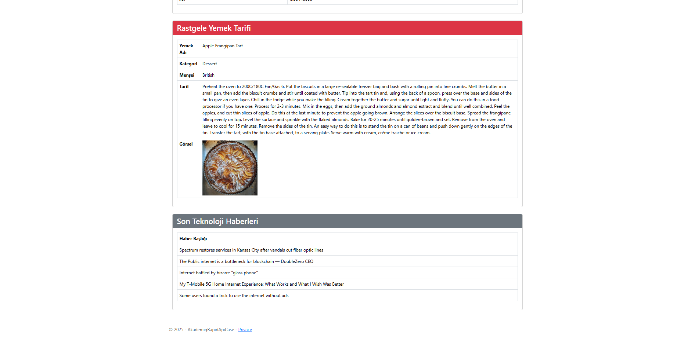

# 🌐 Rapid API Dashboard Projesi

Bu proje, [AkademIQ.Net](https://akademiq.net) tarafından verilen **"C# ile Programlamaya Giriş"** eğitimi kapsamında hazırlanan bir ödev çalışmasıdır. Amaç; farklı API’lerden alınan verileri tek bir sayfa kullanarak bir dashboard ekranında sunmaktır.

## 🔎 Proje Hakkında

Dashboard üzerinden aşağıdaki bilgileri gerçek zamanlı olarak takip edebilirsiniz:

- 📈 Döviz Kurları  
- ⛽ Akaryakıt Fiyatları  
- 🌦️ Hava Durumu  
- 🪙 Kripto Para Piyasaları
- 📰 Güncel 5 Haber  
- 🍽️ Yemek Tarifleri  

Tüm bu veriler RapidAPI üzerinden çekilerek ASP.NET Core teknolojisi ile işlenmiştir.

## 🛠️ Kullanılan Teknolojiler

- **ASP.NET Core Framework**
- **Rapid API**
- **HTML / CSS**
- **Bootstrap**
- **JavaScript**
- **LINQ**

## 🧑‍🏫 Eğitim ve Katkı

Bu proje, eğitim sürecinde öğrendiğim bilgilerle geliştirilmiş olup bana API entegrasyonu, frontend-backend iletişimi ve modern web arayüzleri oluşturma konularında büyük katkı sağlamıştır.

Teşekkürler:
- 👨‍🏫 Murat Yücedağ  
- 👨‍🏫 Gökhan Mutluay  
- 🎓 AkademIQ.Net Ekibi

## 📷 Proje Görselleri




## 📁 Projeyi Çalıştırmak

```bash
1. Bu repoyu klonlayın
2. Gerekli NuGet paketlerini yükleyin
3. API key’lerinizi ilgili yerlere girin
4. Projeyi çalıştırın 🚀
